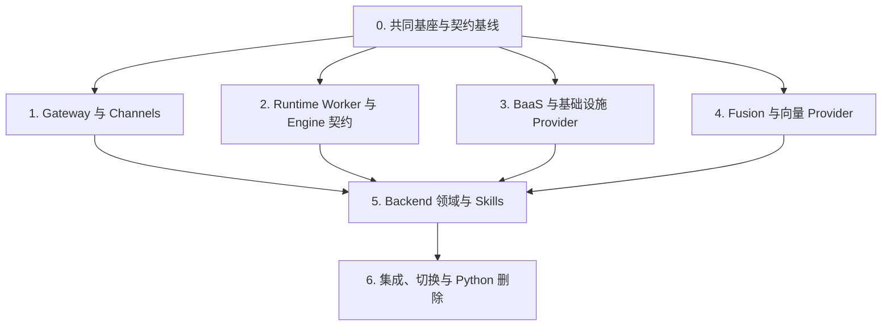

# .NET 10 + Orleans Python 服务迁移实施路线图

> **For agentic workers:** REQUIRED SUB-SKILL: Use superpowers:subagent-driven-development (recommended) or superpowers:executing-plans to implement this plan task-by-task. Steps use checkbox (`- [ ]`) syntax for tracking.

**Goal:** 将 `backend`、`engine`、`baas`、`gateway`、`bcsfuse` 的 Python 实现整体替换为 .NET 10、ASP.NET Core 与 Orleans，同时保留 frontend、OpenClaw/Claude Code Node runtime 和 Rust BCS。

**Architecture:** 迁移拆为七个可独立验收的子项目，先建立契约清单、.NET 架构门禁和 CI，再按 Gateway、Runtime、BaaS、Fusion、Backend/Skills 的依赖顺序交付，最后进行 singlebox/cluster 集成与一次性切换。Python 在切换前只作为行为基线，不引入 `.NET bastion`、Python bridge 或长期双栈生产拓扑；.NET 访问 Rust BCS 只能经过现有版本化 HTTP/WebSocket 契约和 `IBcsClient`。

**Tech Stack:** .NET SDK 10.0.302、C# 14、ASP.NET Core、Orleans、TickerQ 10.4.0、EF Core/Npgsql、PostgreSQL、MinIO、SonnetDB、Qdrant、OpenTelemetry、xUnit 2.9.3、Testcontainers、NBomber。

## Global Constraints

- 全部新项目目标框架为 `net10.0`，启用 nullable、implicit usings 和 warnings-as-errors。
- `openclaw.net/src` 仅供参考；禁止 `OpenClaw.*` ProjectReference、源码链接或 NuGet 依赖。
- Service API 与 Plugin API 必须位于不同项目并使用不同一致性测试套件。
- Core 和 Contracts 禁止引用 ASP.NET Core、EF Core、Orleans 实现、MinIO、SonnetDB、Qdrant 或具体 Plugin。
- Orleans Grain 只承担有稳定身份的状态与协调；数据库访问、向量查询、HTTP 转发、文件传输和进程句柄不能进入 Grain。
- PostgreSQL 分为 `ocb_business`、`ocb_orleans`、`ocb_jobs` 三个 Schema 和角色。
- singlebox 只能选择 SonnetDB，cluster 只能选择 Qdrant；启动时二选一，不长期双写。
- Rust BCS 保持单实例 SQLite；任何 .NET 组件都不得直接访问其 SQLite 文件。
- Skills 必须继续支持 `skills-pool-p3-v1`，只按 Bot 物化已激活内容，不得挂载完整内容仓库。
- TickerQ 10.4.0 只在单一 active Scheduler Host 中运行，并使用 PostgreSQL lease 与 occurrence 幂等键防重。
- 所有配置使用强类型模型并在启动时 fail closed；原始环境变量只能在配置加载、Composition Root 和测试中读取。
- 不迁移历史 MySQL、SQLite、FAISS 或 Qdrant 数据。
- 不修改 frontend、Rust BCS、OpenClaw、BCN plugin 或 Claude Code Node gateway 的实现边界。
- 最终切换前必须通过 Python/.NET contract parity、恢复、安全、性能和 singlebox/cluster 验收。
- 规格来源：`docs/superpowers/specs/2026-08-08-dotnet-orleans-python-services-migration-design.md`。

---

## 子项目与依赖

| 阶段 | 计划文档 | 可独立验收的产物 | 进入条件 | 退出门禁 |
| --- | --- | --- | --- | --- |
| 0 | `2026-08-08-dotnet-foundation-contract-baseline.md` | 可构建的 .NET Solution、架构测试、契约清单、CI 分发 | 已批准设计 | `dotnet_ci.sh`、架构测试和契约清单测试通过 |
| 1 | `2026-08-08-dotnet-gateway-channels.md` | ASP.NET Core Gateway、JWT/principal、HTTP 转发、原生 WebSocket、SSE、Schema Catalog | 阶段 0 | Gateway HTTP/WS/SSE parity 与连接恢复测试通过 |
| 2 | `2026-08-08-dotnet-runtime-worker.md` | Runtime Worker、OpenClaw/Claude Code 反腐层、进程/workspace/lease、Session API | 阶段 0 | 进程丢失、重启、取消、重新分配与 Engine parity 通过 |
| 3 | `2026-08-08-dotnet-baas.md` | Device/Template、sandbox、invoke-http、发布、队列、QPM、SSE、SM4、Provider | 阶段 0 | BaaS Service/Plugin conformance 与端到端生命周期通过 |
| 4 | `2026-08-08-dotnet-fusion-vector.md` | Fusion API、FusionJobGrain、SonnetDB/Qdrant、embedding/reranker Plugin | 阶段 0 | 两套 vector conformance、singlebox/cluster profile 校验通过 |
| 5 | `2026-08-08-dotnet-backend-skills.md` | Bot/Session/asset、tenant guard、MinIO、Skills publication/activation/reconcile | 阶段 1-4 | Backend parity、Skill 失败恢复、租户隔离和 MinIO 补偿通过 |
| 6 | `2026-08-08-dotnet-cutover.md` | 新 singlebox/cluster 镜像、备份恢复、负载基线、切换 Runbook、Python 删除 | 阶段 1-5 | 全栈验收、不可逆 go-live gate、旧 Python 依赖为零 |

计划文件 1-6 在其进入条件满足时编写。这样后续计划使用阶段 0 生成的真实 endpoint、Schema、Plugin 和状态清单，不猜测 2,200 个 Python 文件中的隐式行为。

## 阶段 0：共同基座与契约基线

执行 `docs/superpowers/plans/2026-08-08-dotnet-foundation-contract-baseline.md`。

产物：

- `dotnet/Ocb.slnx` 和中央构建配置；
- `Ocb.Contracts`、`Ocb.Core`、`Ocb.PluginApi`、`Ocb.Configuration`；
- `Ocb.Architecture.Tests`、`Ocb.Contracts.Tests`；
- 每个项目的 `context-boundary.json`；
- 由 AST/JSON/YAML 结构化解析生成的 `migration-inventory.json`；
- `scripts/ci/dotnet_ci.sh`、pre-push 分发和 GitHub Actions job；
- Python 基线 OpenAPI 与 WebSocket/SSE/BCS 契约 corpus manifest。

禁止在该阶段创建业务 endpoint、Grain、数据库表、bridge 或替换启动脚本。

## 阶段 1：Gateway 与 Channels

计划必须以阶段 0 的 Gateway inventory 为输入，至少包含以下独立任务：

1. ASP.NET Core Composition Root、严格配置和 readiness；
2. `CallerContext`、JWT、`X-Avernet-Principal`、access key 和 tenant 二次校验；
3. 现有 path/domain forwarding 与 Schema Catalog；
4. `Ocb.Channels.WebSocketChannel` 的 fragment、raw/JSON envelope、限流、串行发送和清理；
5. `ConnectionDirectoryGrain`、Gateway lease 与 Orleans Streams 路由；
6. SSE 背压、取消和 correlation；
7. HTTP、WebSocket 和 SSE parity corpus；
8. NBomber 长连接基线。

不得使用 SignalR，不得引入 Canvas envelope。

## 阶段 2：Runtime Worker 与 Engine 契约

计划必须以阶段 0 的 Engine inventory 为输入，至少包含：

1. Session API parity；
2. Runtime Worker assignment 和 lease；
3. OpenClaw/Claude Code typed client 与反腐模型；
4. 进程启动、健康、日志、取消、关闭和端口分配；
5. workspace 创建、隔离、清理和 orphan recovery；
6. `BotRuntimeGrain` desired/observed state；
7. Worker 丢失与 Grain reactivation 测试；
8. Skills 物化接口，但不实现 Backend publication 所有权。

进程句柄和本地路径不能成为 Grain 的权威状态。

## 阶段 3：BaaS 与基础设施 Provider

计划必须覆盖完整 BaaS 能力，不得缩减为 CRUD：

1. health、Device、Template 和 tenant；
2. Docker/Kubernetes sandbox Provider conformance；
3. 透明 `invoke-http` 和 API gateway；
4. Bot 发布与运行队列；
5. QPM、Device TTL、billing control 和第三方边界；
6. SSE；
7. PostgreSQL business persistence；
8. SM4 known-answer、round-trip、invalid-key、padding、tamper 测试。

SM2 不在范围内。

## 阶段 4：Fusion 与向量 Provider

计划必须覆盖：

1. `POST /api/v1/groups/{group_id}/fuse` 及 worker profile/config 契约；
2. Fusion API 使用 `CallerContext` 显式传递 tenant/subject,并在 `FusionJobGrain` 边界复核 tenant key；Python 过渡期的 trust-gateway 绕过不得迁移到 .NET；
3. `FusionJobGrain` 串行协调和幂等状态；
4. `IVectorStore`、`IHybridSearchStore`、`IVectorStoreAdministration`；
5. SonnetDB singlebox Provider；
6. Qdrant cluster Provider；
7. embedding/reranker 独立 Plugin API；
8. dimension/model 不兼容 fail closed；
9. 两个 Provider 共用的 conformance suite。

## 阶段 5：Backend 领域与 Skills

计划必须覆盖：

1. Caller Identity、Bot、Session、asset 和 tenant guard；
2. PostgreSQL `ocb_business` migration；
3. MinIO multipart、checksum、signed URL、range、临时发布和删除补偿；
4. Bot/Session/Device 等 Grain 的稳定 tenant key；
5. `git://`、`local://`、`center://` 的不可变版本与发布状态；
6. `skills-pool-p3-v1` layout manifest；
7. Runtime Worker 按 Bot 物化；
8. 下载三次指数退避、integrity failure 不重试、原子发布回滚、无旧视图时 fail closed；
9. Service API 与 Plugin API conformance；
10. Backend HTTP parity 和关键用户故事。

## 阶段 6：集成、切换与 Python 删除

计划必须覆盖：

1. singlebox 与 cluster 两种 Profile；
2. Gateway、Silo、Runtime Worker、Scheduler、BCS 独立进程/镜像；
3. TickerQ active Scheduler Host、PostgreSQL lease、outbox、retry、dead letter；
4. PostgreSQL/MinIO/vector/BCS SQLite 备份恢复演练；
5. x64/arm64 和公共 package source 构建；
6. OpenTelemetry、健康检查、告警和 secret redaction；
7. Python/.NET 全契约 parity；
8. NBomber P95/P99/吞吐与资源基线；
9. 维护窗口、全新数据初始化、readiness 和 go-live 决策；
10. 验收后删除 Python 服务、FastAPI/Uvicorn 依赖和旧 CI 分支。

开放持久写入后不能自动回滚到 Python。Runbook 必须把 go-live 明确标记为不可逆决策。

## 全局完成定义

- 五个目标服务不存在 Python runtime/import 依赖；
- frontend 和 Rust BCS 契约测试保持通过；
- Service API、Plugin API、HTTP、WebSocket、SSE 和 vector conformance 全部通过；
- singlebox 使用 SonnetDB，cluster 使用 Qdrant；
- PostgreSQL、MinIO、vector 和 BCS SQLite 恢复演练通过；
- 多 Silo、Worker 丢失、Streams、Reminders、scheduler lease 和重复投递测试通过；
- 安全评审、依赖扫描、secret 扫描、license 扫描和性能基线通过；
- 文档、Docker、部署、API 和贡献者指南已更新。
